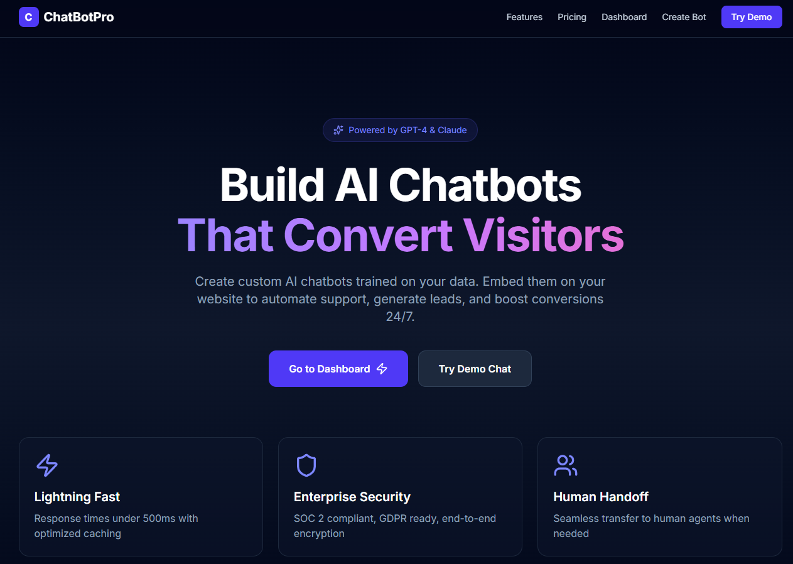
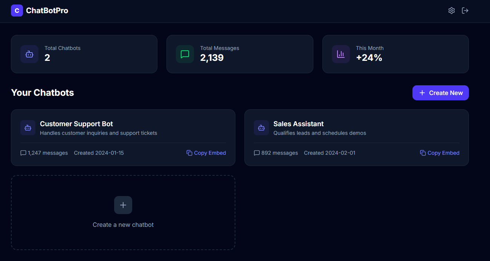
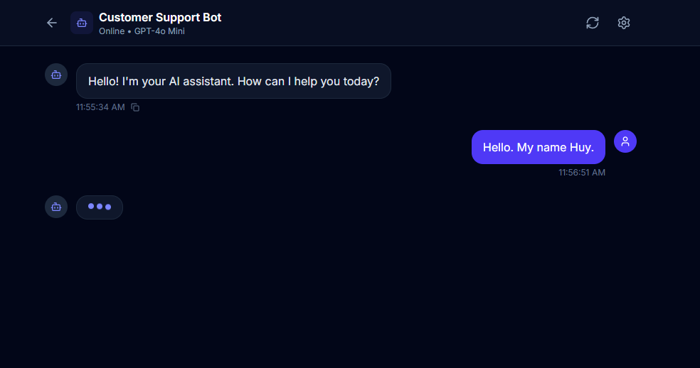

# 🤖 ChatBotPro - AI Chatbot Builder SaaS

<p align="center">
  
  
  
  
  
</p>

> 🔥 **Production-ready AI Chatbot Builder** — Build, customize, and deploy AI chatbots for your website in minutes.

## ✨ Features

- **Custom AI Training** — Train chatbots on your data
- **Natural Conversations** — Advanced NLP with context awareness
- **Easy Embed** — Copy-paste widget code
- **Stripe Integration** — Secure payment processing
- **Google & GitHub OAuth** — Easy authentication

## 📸 Preview

| Page | Image |
|------|-------|
| Landing |  |
| Dashboard |  |
| Chat |  |

## 🛠️ Getting Started

```bash
git clone https://github.com/nguyenduchuynet/AI-SaaS-Chatbot.git
cd AI-SaaS-Chatbot
npm install
cp .env.example .env
npm run dev
```

Open [http://localhost:3000](http://localhost:3000)

## 📁 Project Structure

```
├── src/
│   ├── app/           # Next.js App Router
│   ├── components/   # React components
│   └── lib/          # Utilities
├── public/
│   └── images/       # Preview images
└── README.md
```

---

<p align="center">
  Built with ❤️ by <a href="https://github.com/nguyenduchuynet">Huy Nguyen</a>
</p>
